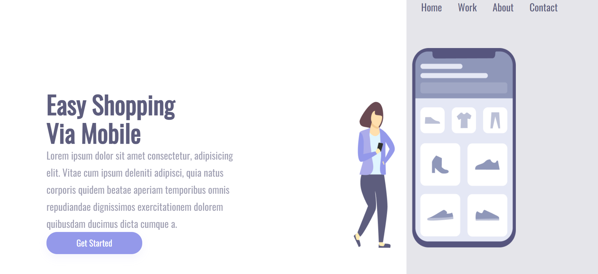
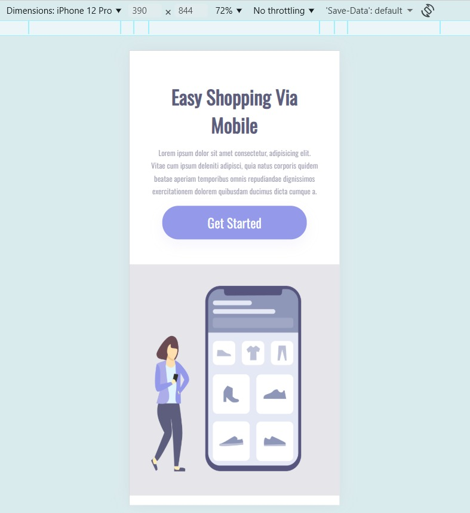

# 📱 Easy Shopping Via Mobile

* Este projeto consiste em uma landing page responsiva desenvolvida com  e  , simulando a apresentação de uma plataforma de compras voltada para dispositivos móveis.

* A interface foi construída com um layout dividido em duas seções principais: uma área de destaque com título, descrição e botão de ação, e uma área visual com navegação e imagem ilustrativa do aplicativo. O objetivo é apresentar um design moderno, limpo e focado na experiência do usuário.

* Durante o desenvolvimento foram aplicados conceitos importantes de front-end, como estruturação semântica do HTML, estilização com CSS, posicionamento de elementos, uso de tipografia externa (Google Fonts) e responsividade utilizando media queries, garantindo que a interface se adapte corretamente a diferentes tamanhos de tela.

 🔗 Acesse o projeto online: https://brunorael.github.io/Projeto-Phone/

 
 
